# 🩺 Breast Cancer Classification System — Azure Cloud Deployment

A full-stack medical imaging web application that classifies breast cancer histopathology images as **Benign** or **Malignant** using a **VGG16 deep learning model**, deployed on **Microsoft Azure App Service** with a containerized multi-service architecture.

> **Live URL:** [breast-cancer-classfication-system.azurewebsites.net](https://breast-cancer-classfication-system-h2dzeyetejehh8f0.eastasia-01.azurewebsites.net)

---

## 📌 Project Highlights

- **Deep Learning (VGG16)** model trained on breast cancer histopathology images
- **Role-based access control** — Admin approves/rejects doctor registrations; only verified doctors can classify images
- **Multi-container Docker deployment** on Azure App Service (Flask + MySQL sidecar)
- **CI/CD-ready** architecture with Docker Hub and Azure Deployment Center integration
- **Self-healing database** — MySQL auto-imports schema on every cold start via custom Docker image

---

## 🏗️ Architecture

```
                        ┌──────────────────────────────────┐
                        │         Azure App Service        │
                        │          (Linux, B1 Plan)        │
                        │                                  │
   Internet ──────────► │  ┌──────────────────────────┐    │
                        │  │   Main Container (5000)   │    │
                        │  │   Flask + Gunicorn        │    │
                        │  │   VGG16 Model (TF/Keras)  │    │
                        │  └──────────┬───────────────┘    │
                        │             │                    │
                        │             ▼                    │
                        │  ┌──────────────────────────┐    │
                        │  │   Sidecar Container       │    │
                        │  │   MySQL 8.0 (Custom)      │    │
                        │  │   Auto-imports epca.sql   │    │
                        │  └──────────────────────────┘    │
                        └──────────────────────────────────┘
```

---

## 🛠️ Tech Stack

| Layer | Technology |
|-------|-----------|
| **Frontend** | HTML, CSS, Bootstrap, Jinja2 |
| **Backend** | Python 3.9, Flask, Gunicorn |
| **ML Model** | VGG16 (TensorFlow / Keras) |
| **Database** | MySQL 8.0 |
| **Containerization** | Docker (multi-stage builds) |
| **Cloud** | Microsoft Azure App Service |
| **Registry** | Docker Hub |
| **OS** | Linux (Ubuntu) |

---

## 📸 Screenshots

### Application

<table>
  <tr>
    <td align="center"><b>Login Page</b></td>
    <td align="center"><b>Registration Page</b></td>
  </tr>
  <tr>
    <td>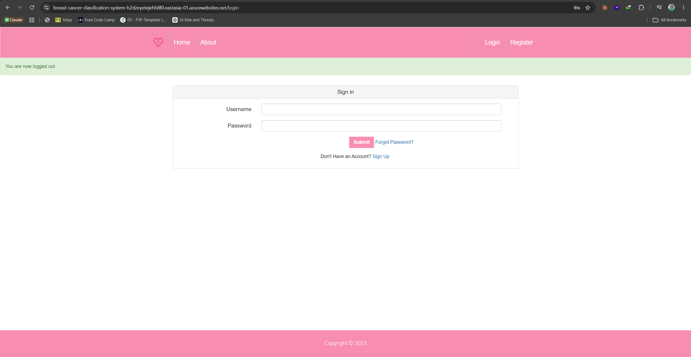</td>
    <td>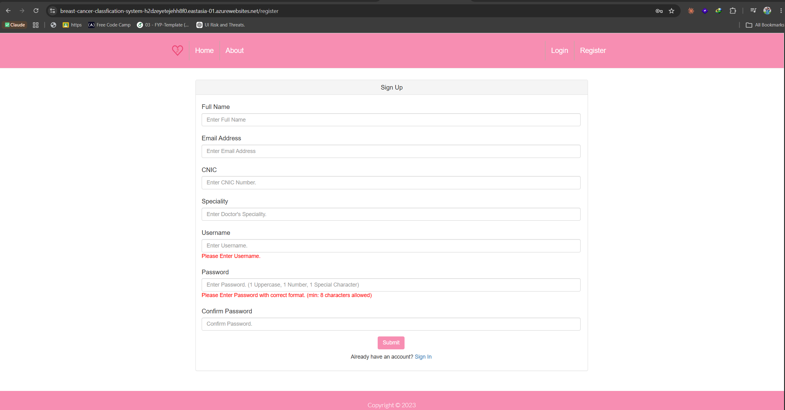</td>
  </tr>
  <tr>
    <td align="center"><b>Admin Dashboard</b></td>
    <td align="center"><b>Admin — Approve/Reject Doctors</b></td>
  </tr>
  <tr>
    <td>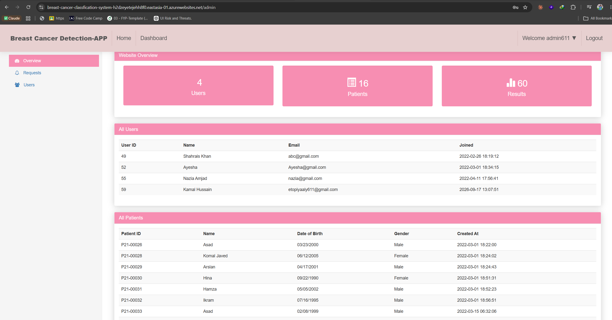</td>
    <td>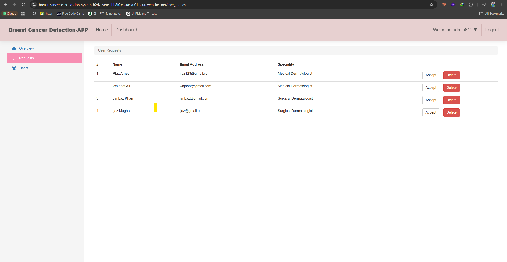</td>
  </tr>
  <tr>
    <td align="center"><b>Doctor Dashboard</b></td>
    <td align="center"><b>Classify Disease (VGG16 Prediction)</b></td>
  </tr>
  <tr>
    <td>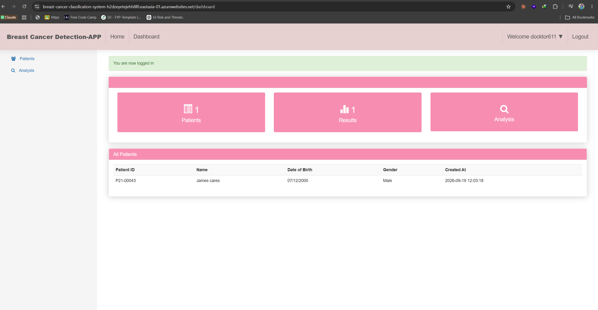</td>
    <td>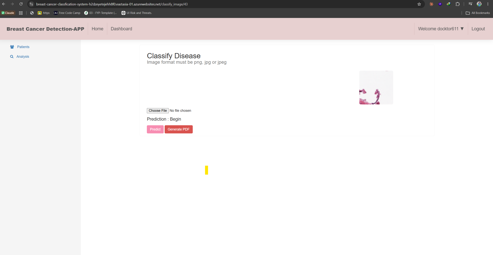</td>
  </tr>
</table>

### Prediction Result

<table>
  <tr>
    <td align="center"><b>VGG16 Classification Output</b></td>
  </tr>
  <tr>
    <td></td>
  </tr>
</table>

### Azure Infrastructure

<table>
  <tr>
    <td align="center"><b>App Service Overview</b></td>
    <td align="center"><b>Deployment Center (Multi-Container)</b></td>
  </tr>
  <tr>
    <td>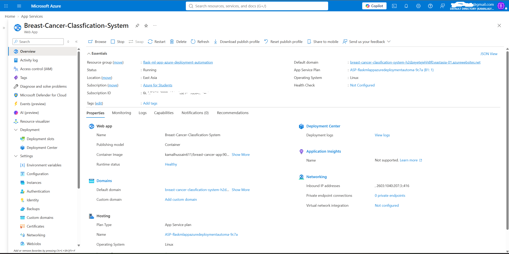</td>
    <td>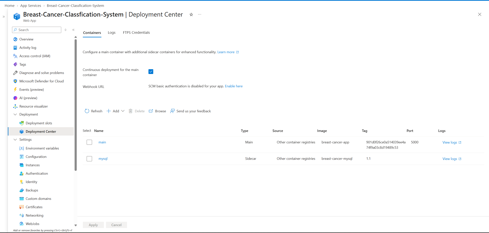</td>
  </tr>
  <tr>
    <td align="center"><b>App Service — Running</b></td>
    <td align="center"><b>Environment Variables</b></td>
  </tr>
  <tr>
    <td>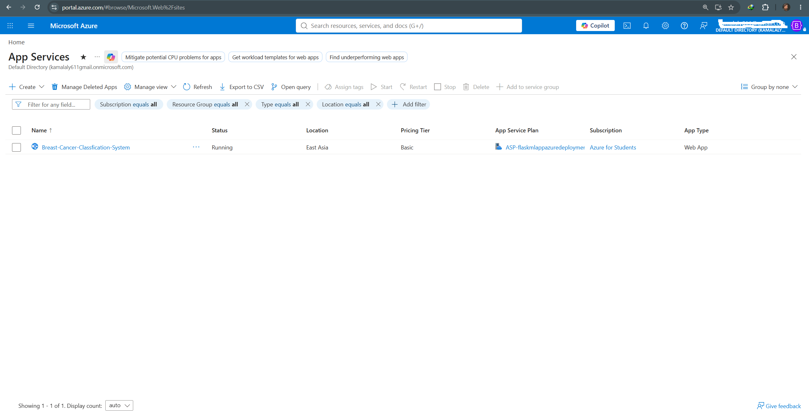</td>
    <td>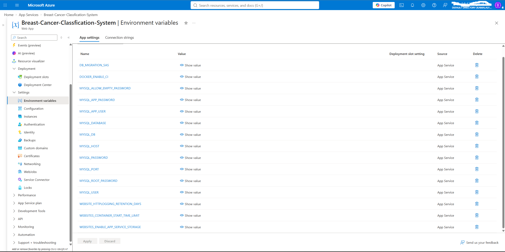</td>
  </tr>
</table>

### Docker & DevOps

<table>
  <tr>
    <td align="center"><b>Docker Images</b></td>
    <td align="center"><b>Multi-Stage Dockerfile</b></td>
  </tr>
  <tr>
    <td>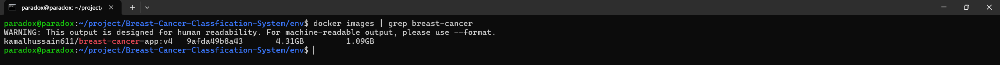</td>
    <td>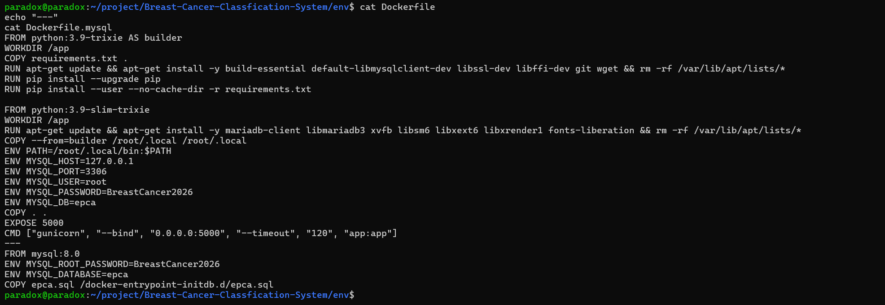</td>
  </tr>
  <tr>
    <td align="center"><b>Site Containers (Main + MySQL Sidecar)</b></td>
    <td align="center"><b>Live Health Check (HTTP 200)</b></td>
  </tr>
  <tr>
    <td>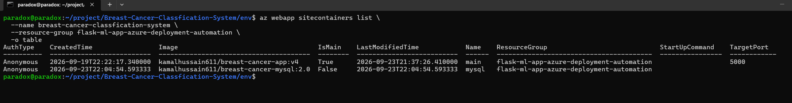</td>
    <td>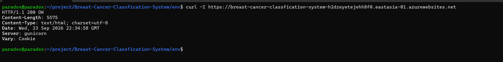</td>
  </tr>
  <tr>
    <td align="center"><b>Git Commit History</b></td>
    <td></td>
  </tr>
  <tr>
    <td>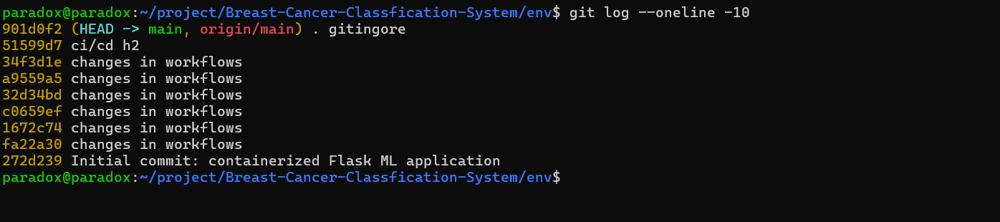</td>
    <td></td>
  </tr>
</table>

---

## 🔑 Live Demo

> 🌐 **[Try it live](https://breast-cancer-classfication-system-h2dzeyetejehh8f0.eastasia-01.azurewebsites.net/login)**
>
> **Doctor Login:** `docktor611` / `Kamal@123`
>
> Upload a histopathology image → click **Predict** → see VGG16 classification result

---

## 🔐 Role-Based Access

| Role | Access Level |
|------|-------------|
| **Admin** | Dashboard with user/patient/result stats, approve or reject doctor requests, manage all users |
| **Doctor** | Add patients, upload histopathology images, run VGG16 classification, generate PDF reports |
| **Pending** | Registered but awaiting admin approval |

---

## 🚀 Getting Started

### Prerequisites

- Python 3.9+
- Docker & Docker Compose
- Git
- Azure CLI (for cloud deployment)

### Run Locally

```bash
# Clone the repository
git clone https://github.com/kamalhussaindev/flask-ml-app-azure-deployment-automation.git
cd flask-ml-app-azure-deployment-automation

# Create virtual environment
python -m venv env
source env/bin/activate        # Linux/Mac
# env\Scripts\activate         # Windows

# Install dependencies
pip install -r requirements.txt

# Run the application
python app.py
```

Visit `http://localhost:5000`

### Run with Docker

```bash
# Build the Flask app image
docker build -t breast-cancer-app .

# Run with Docker Compose (Flask + MySQL)
docker-compose up -d
```

---

## ☁️ Azure Deployment

### Step 1 — Build and push Docker images

```bash
# Flask application (multi-stage build)
docker build -t <your-dockerhub>/breast-cancer-app:latest .
docker push <your-dockerhub>/breast-cancer-app:latest

# Custom MySQL with baked-in schema
docker build -f Dockerfile.mysql -t <your-dockerhub>/breast-cancer-mysql:latest .
docker push <your-dockerhub>/breast-cancer-mysql:latest
```

### Step 2 — Create Azure App Service

```bash
az group create --name flask-ml-app-rg --location eastasia

az appservice plan create \
  --name flask-ml-plan \
  --resource-group flask-ml-app-rg \
  --is-linux --sku B1

az webapp create \
  --name <your-app-name> \
  --resource-group flask-ml-app-rg \
  --plan flask-ml-plan \
  --container-image-name <your-dockerhub>/breast-cancer-app:latest
```

### Step 3 — Enable Site Containers mode and add MySQL sidecar

```bash
# Switch to multi-container mode
az webapp config set \
  --name <your-app-name> \
  --resource-group flask-ml-app-rg \
  --linux-fx-version "SITECONTAINERS"

# Add MySQL as a sidecar container
az webapp sitecontainers create \
  --name <your-app-name> \
  --resource-group flask-ml-app-rg \
  --container-name mysql \
  --image <your-dockerhub>/breast-cancer-mysql:latest \
  --is-main false
```

### Step 4 — Configure environment variables

```bash
az webapp config appsettings set \
  --name <your-app-name> \
  --resource-group flask-ml-app-rg \
  --settings \
    MYSQL_HOST=127.0.0.1 \
    MYSQL_PORT=3306 \
    MYSQL_ROOT_PASSWORD=<your-password> \
    MYSQL_DATABASE=epca \
    MYSQL_DB=epca
```

### Step 5 — Restart and verify

```bash
az webapp restart --name <your-app-name> --resource-group flask-ml-app-rg

# Wait 3-5 minutes for MySQL to initialize, then verify
curl -I https://<your-app-name>.azurewebsites.net
```

---

## 📁 Project Structure

```
flask-ml-app-azure-deployment-automation/
├── app.py                    # Main Flask application
├── Dockerfile                # Multi-stage Flask app image
├── Dockerfile.mysql          # Custom MySQL with baked-in schema
├── start.sh                  # Entrypoint script (MySQL wait + env config)
├── docker-compose.yml        # Local multi-container setup
├── requirements.txt          # Python dependencies
├── epca.sql                  # Database schema and seed data
├── .gitignore
├── static/                   # CSS, JS, images
├── templates/                # Jinja2 HTML templates
│   ├── home.html
│   ├── login.html
│   ├── register.html
│   ├── admin.html
│   ├── dashboard.html
│   ├── classify_image.html
│   └── ...
└── screenshots/              # Project screenshots
```

---

## 🧠 ML Model Details

- **Architecture:** VGG16 (transfer learning)
- **Task:** Binary classification — Benign vs Malignant
- **Input:** Breast cancer histopathology images (PNG, JPG, JPEG)
- **Output:** Classification result with confidence + PDF report generation
- **Framework:** TensorFlow / Keras

---

## 🔧 DevOps Practices Used

- **Containerization** — Multi-stage Docker builds for optimized image size
- **Multi-container deployment** — Flask app + MySQL sidecar on Azure Site Containers
- **Environment-based configuration** — All secrets managed via Azure App Settings
- **Self-healing database** — SQL dump baked into custom MySQL image for automatic initialization on cold starts
- **Container registry** — Docker Hub for image storage and versioning
- **Continuous deployment** — Azure Deployment Center with webhook integration

---

## 📄 License

This project is for educational and portfolio purposes.

---

## 👤 Author

**Kamal Hussain**

- GitHub: [@kamalhussaindev](https://github.com/kamalhussaindev)
- LinkedIn: [Connect with me](https://linkedin.com/in/kamalhussaindev)
- Email: kamalhussaindev@gmail.com
